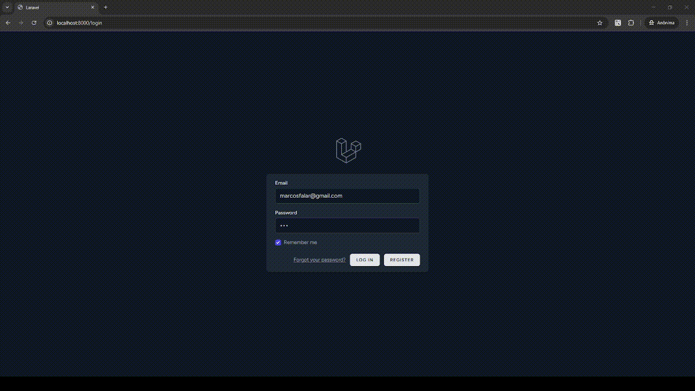

# Short URL App (Laravel)

A minimal, production-ready URL shortener built with Laravel. It includes authentication, per-user quotas, deletion with confirmation, an interstitial “redirect” page with a countdown, and Alpine.js toasts for feedback.

> **Why this project?**
> Quick to set up, easy to extend, and uses the standard Laravel stack (Breeze + Tailwind + Alpine) so you can customize fast.

---



## Features

* 🔐 Auth & email verification (Laravel Breeze)
* ➕ Create short links (unique `short_code`)
* 📉 Per-user quota (default: max 10 links)
* 🗑️ Delete with friendly confirmation
* 🚦 Interstitial redirect page (countdown + animation) before sending to the target URL
* 🔔 Flash messages via Alpine.js toast

---

## Tech Stack

* Laravel (Breeze, Validation, Eloquent)
* Blade + Tailwind CSS + Alpine.js
* MySQL (or any DB supported by Laravel)

---

## Getting Started

### Requirements

* PHP 8.2+
* Composer
* Node.js + npm
* MySQL (or Postgres/SQLite)

### Installation

```bash
# 1) Clone & install
composer install
npm install

# 2) Environment
cp .env.example .env
php artisan key:generate

# 3) Configure DB credentials in .env
# DB_DATABASE=...
# DB_USERNAME=...
# DB_PASSWORD=...

# 4) Migrate & seed (optional)
php artisan migrate

# 5) Build frontend
npm run build   # or: npm run dev

# 6) Run app
php artisan serve
```


MIT — use freely, attribute appreciated.
